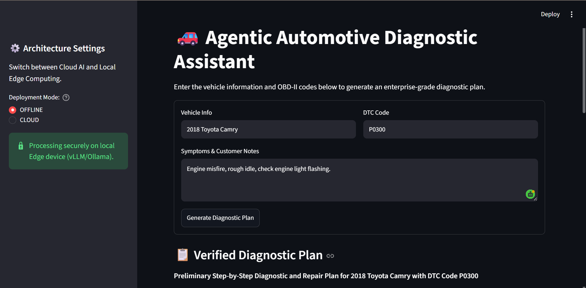
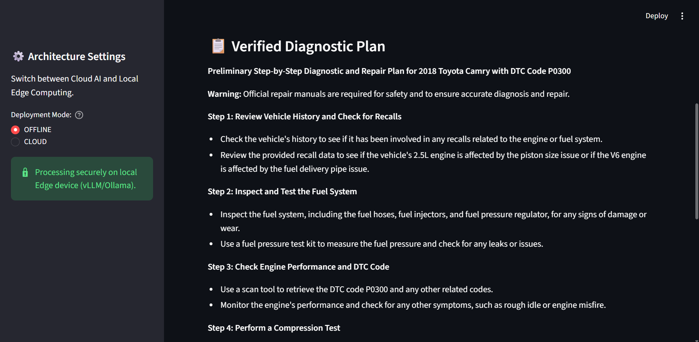
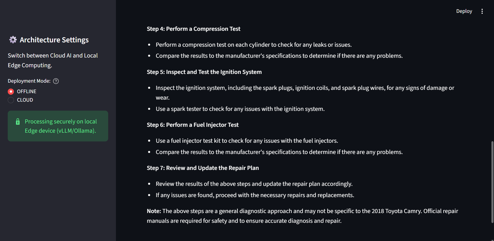
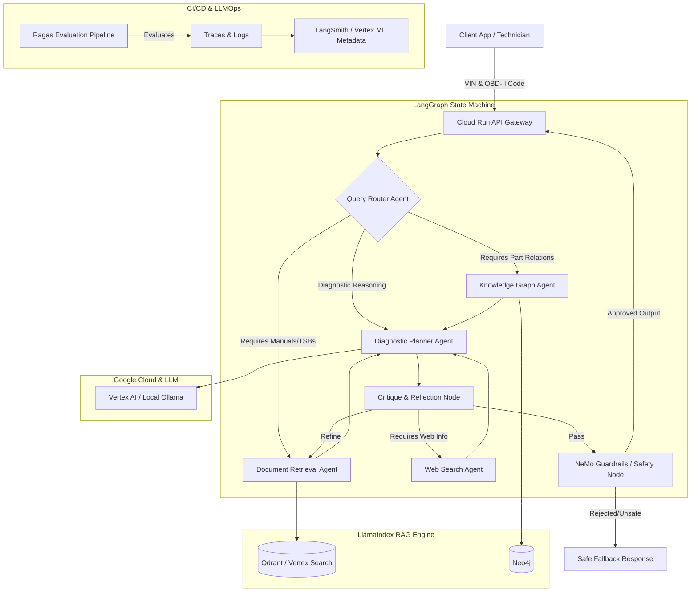

# 🚗 Agentic Automotive Diagnostic Assistant

An enterprise-grade, dual-mode (Cloud & Offline) AI Assistant for automotive diagnostics. This system utilizes a multi-agent orchestrated workflow, integrating GraphRAG (Neo4j) and Vector Search (Qdrant) to intelligently retrieve and analyze automotive repair manuals and DTC (Diagnostic Trouble Code) context.

## ✨ Key Features

*   **Dual-Mode Architecture**: Run completely offline on local CPU/GPUs (using vLLM/Ollama), or seamlessly switch to Google Cloud Serverless (Vertex AI / Gemini).
*   **Agentic Workflow**: Powered by LangGraph to orchestrate Planning, Retrieval, and Diagnostic Formulation agents.
*   **Hybrid RAG (Graph + Vector):** Combines LlamaIndex `PropertyGraphIndex` (Neo4j) for traversing multi-hop part relationships with Vertex AI Vector Search for retrieving dense unstructured manual steps.
*   **Cost-Optimized Context**: Utilizes Google Vertex AI (Gemini 2.5 Pro) with Vertex AI Context (KV) Caching to load massive OEM workshop manuals into memory once, drastically reducing per-query token costs and latency.
*   **Dynamic LLM Selection**: Switch instantly between Vertex AI models (e.g. Gemini 2.5 Pro, Gemini 1.5 Flash) directly from the Streamlit UI with zero infrastructure redeployment.
*   **Enterprise Safety Guardrails**: Integrated NeMo Guardrails intercept and block unsafe DIY advice (e.g., high-voltage EV battery handling without proper PPE).
*   **Microservices & Managed Cloud**: A decoupled FastAPI backend, Streamlit frontend, and fully managed cloud databases (Neo4j AuraDB & Qdrant Cloud).

## 🖥️ UI Showcase
The frontend is built using Streamlit, providing an interactive interface for technicians to input DTC codes and symptoms, while seamlessly toggling between Cloud and Local Edge computing modes.




## 🏗 Architecture (Dual-Mode)

This application is designed with an `InfraFactory` that allows zero-downtime switching between two deployment modes via a single environment variable (`DEPLOYMENT_MODE`):

1. **CLOUD Mode (Managed):** Uses Google Vertex AI (Gemini 2.5 Pro, 1.5 Flash), Neo4j AuraDB, and Qdrant Cloud. Designed for high scalability, speed, and serverless enterprise deployments.

2. **OFFLINE Mode (Edge / CPU-Friendly):** Uses local HuggingFace CPU embeddings, local Qdrant, Neo4j Docker, and Ollama (`llama3.1`). **The system automatically detects if a GPU is missing and falls back to CPU-compatible models, meaning this entire enterprise application can run 100% offline on a standard laptop CPU!**
---

## 🛠️ Setup & Installation
### Prerequisites
- Python 3.10+
- Docker & Docker Compose (for local database stacks)
- `gcloud` CLI & Terraform (for cloud deployment)

### 1. Project Initialization
Clone the repository:
```bash
git clone https://github.com/skumar6257/Agentic_Automotive-Diagnostic_Assistant
cd Agentic_Automotive-Diagnostic_Assistant
```
Set up a Python Virtual Environment:
```bash
python -m venv venv
# On Windows:
.\venv\Scripts\activate
# On Mac/Linux:
source venv/bin/activate
```
Install dependencies:
```bash
pip install -r requirements.txt
```
### 2. Environment Configuration
Copy the environment template and configure your deployment mode:
```bash
cp .env.example .env
```
*Open `.env` and fill in your API keys, local URLs, and Cloud Endpoints. Make sure `DEPLOYMENT_MODE=OFFLINE` is set in `.env` if you are testing locally.*

### 3. Start Local Databases (Offline Mode)
Spin up the local Neo4j graph database using Docker Compose:
```bash
docker-compose up -d
```

### 4. Data Ingestion Pipeline
Before the AI Agents can run, we must fetch real-world automotive data and ingest it into our databases.
**Step 4a: Fetch Raw Data**
Downloads real OBD-II DTC codes and TSBs from the NHTSA API.
```bash
python data/fetch_real_data.py
```
**Step 4b: Vector Database Ingestion (Unstructured Text)**
Chunks the repair manuals and TSBs, generates embeddings, and saves the Vector DB to disk.
```bash
python index/vector_ingest.py
```
**Step 4c: Graph Database Ingestion (Topological Data)**
Parses the structured DTC codes into Neo4j nodes (DTC -> Part -> Subsystem).
```bash
python index/graph_ingest.py
```

### 5. Enterprise Guardrails & Context Caching 
This application includes enterprise-grade guardrails and context caching to ensure safe and cheap inference.

**Safety Guardrails (NeMo):**
The system intercepts user queries using NVIDIA NeMo Guardrails. 
To modify safety rules (e.g., preventing high-voltage or emissions bypass advice), edit the Colang file:
`config/guardrails/safety.co`
*(Note: To run NeMo efficiently on CPUs without LLM latency, it is configured in `embeddings_only: True` mode in `config.yml`.)*

**KV Context Caching:**
- **CLOUD Mode:** If using Google Vertex AI (`DEPLOYMENT_MODE=CLOUD`), massive OEM manuals are cached using `infra/cache_manager.py` to drastically reduce token costs.
- **OFFLINE Mode (GPU):** If deploying locally with an NVIDIA GPU, install vLLM via pip (`pip install vllm`). Start your inference engine with Prompt Caching enabled:
  ```bash
  pip install vllm
  ```
  
  ```bash
  python -m vllm.entrypoints.openai.api_server --model meta-llama/Meta-Llama-3-8B-Instruct --enable-prefix-caching
  ```

### 6. Running the Application (FastAPI & Streamlit UI)
If you are running in OFFLINE mode on a CPU, you must start your local LLM engine first:
1. Install [Ollama](https://ollama.com/) (If not available)
2. Open a terminal and run: `ollama run llama3.1`

This application features a full microservices architecture (FastAPI backend + Streamlit frontend).
**Terminal 1 (Backend API):**
```bash
uvicorn backend.api.main:app --host 0.0.0.0 --port 8000
```

**Terminal 2 (Frontend UI):**
```bash
streamlit run frontend/app.py
```

### 7. ☁️ Running in the CLOUD (Google Cloud Platform)
*Leverages Google Cloud Run, Vertex AI, and managed cloud databases for infinite scalability.*

**1. Deploy the Backend Infrastructure:** For detailed instructions on how to build the Docker image, configure IAM permissions, and run Terraform, please read the [Cloud Deployment Guide](README_CLOUD.md).

**2. Start the Frontend UI (Local):**
```bash
streamlit run frontend/app.py
```

*Go to the UI and ensure the toggle is set to CLOUD. The frontend will automatically route requests to your live Serverless endpoint!*

### 8. LLMOps & Automated Evaluation (Ragas)
To mathematically evaluate the quality of the LLM responses (Faithfulness, Context Precision, Answer Relevancy), we utilize the **Ragas** framework. 
Run the offline CPU evaluation script:
```bash
python eval/evaluate.py
```
---

## 📂 Project Structure

- `agents/` - LangChain agent definitions (Planner, Retriever, Formulator).
- `backend/` - FastAPI gateway endpoints.
- `frontend/` - Streamlit User Interface.
- `infra/` - InfraFactory logic for dynamic Cloud/Offline routing.
- `terraform/` - IaC for GCP Cloud Run deployment.

## 🔄 Workflow Architecture

